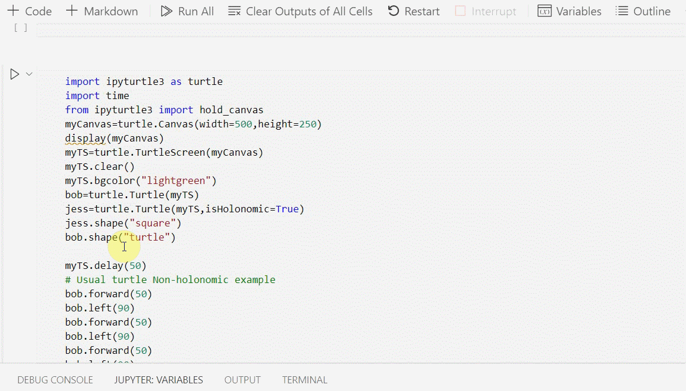

## Demo 




Turtle graphics based on ipycanvas which can run on jupyter lab/notebook/vscode.


https://github.com/williamnavaraj/ipyturtle3/blob/main/Images/TurtleWin.gif

## Usage: Installation

```
pip install ipyturtle3
```
## Example ipynb code. Run this in a cell.

```
import ipyturtle3 as turtle
from ipyturtle3 import hold_canvas
myCanvas=turtle.Canvas(width=500,height=250)
display(myCanvas)
myTS=turtle.TurtleScreen(myCanvas)
myTS.clear()
myTS.bgcolor("lightgreen")
bob=turtle.Turtle(myTS)
jess=turtle.Turtle(myTS,isHolonomic=True)
jess.shape("square")
bob.shape("turtle")

myTS.delay(200)
# Usual turtle Non-holonomic example
bob.forward(50)
bob.left(90)
bob.forward(50)
bob.left(90)
bob.forward(50)
bob.left(90)
bob.forward(50)


#Holonomic
jess.moveleft(200)
jess.moveup(100)
jess.moveright(100)
jess.movedown(100)
jess.turnright(45)
jess.turn(-45)
jess.distance_at_angle(50,45)

myTS.clear()

# Rainbow benzene
colors = ['red', 'purple', 'blue', 'green', 'orange', 'yellow']
t = turtle.Turtle(myTS)
myTS.bgcolor('black')
for x in range(50):
    with(hold_canvas(myCanvas)):
        t.pencolor(colors[x%6])
        t.width(x//100 + 1)
        t.forward(x)
        t.left(59)
```